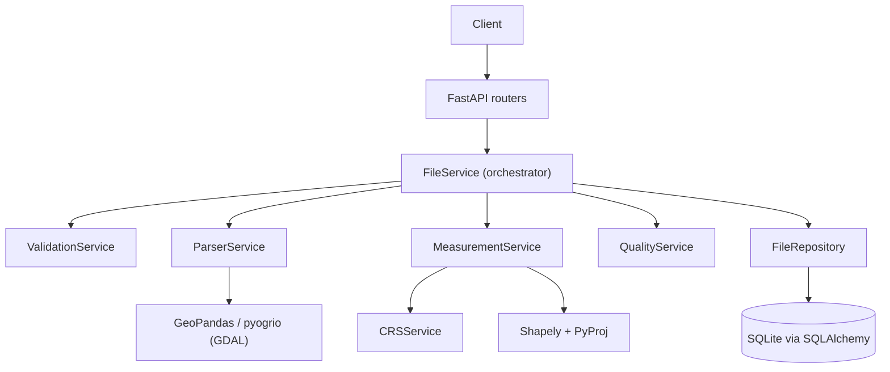
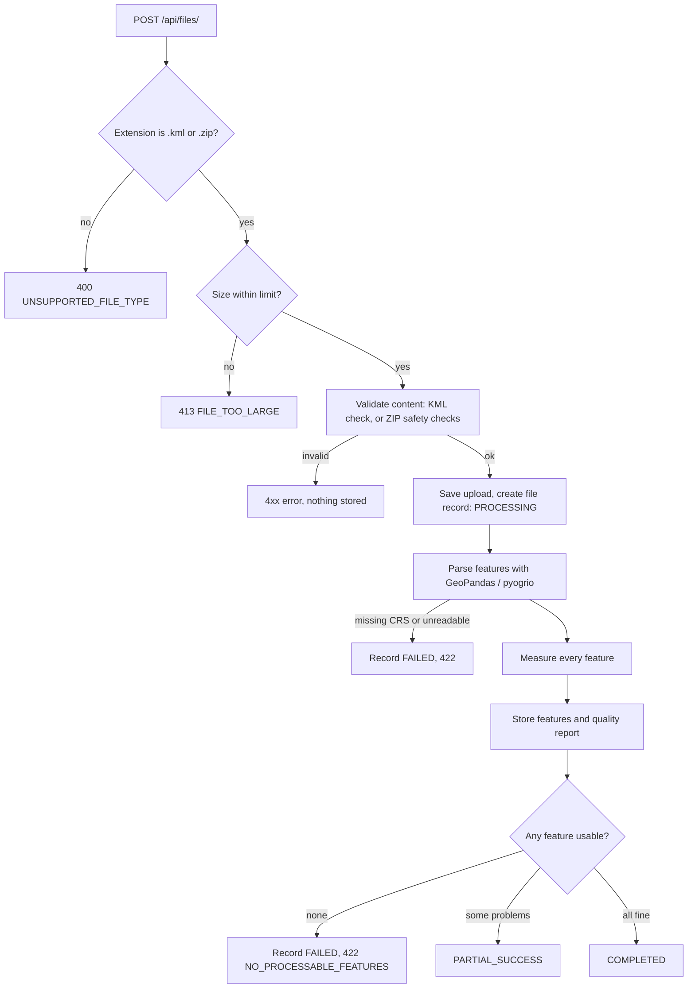
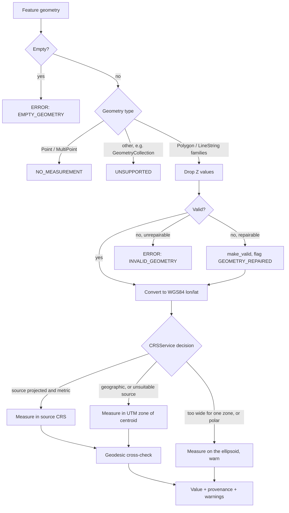

# GeoMeasure: Geospatial File Measurement API

A FastAPI backend that accepts a **KML** file or a **zipped Shapefile**, extracts every feature, and returns
**CRS-correct area and length measurements**, together with a record of *how* each number was produced and
checked.

> **The idea:** most solutions return a number. This one returns the number *plus the evidence that it is
> right*: which projected CRS was used and why, an independent geodesic cross-check, warnings for anything
> that was repaired or unusual, and a data quality report for the whole file.

**Contents:** [Setup](#setup) · [API](#api) · [Architecture](#architecture) · [Design Decisions](#design-decisions) ·
[Testing](#testing) · [Assumptions and Limitations](#assumptions-and-limitations) · [Learning](#learning) ·
[Future Scope](#future-scope)

---

## Setup

**Requirements:** Python 3.10 or newer (developed and tested on 3.12). No system GDAL install is needed: the
`pyogrio`, `shapely` and `pyproj` wheels bundle what they need.

### Windows (PowerShell)

```powershell
git clone https://github.com/Potharaju-Vinay/aereo-geospatial-api.git
cd aereo-geospatial-api
python -m venv .venv
.venv\Scripts\Activate.ps1
python -m pip install -r requirements.txt
copy .env.example .env
uvicorn app.main:app --reload
```

If PowerShell blocks the activation script, run `Set-ExecutionPolicy -Scope Process Bypass` once.

### macOS / Linux

```bash
git clone https://github.com/Potharaju-Vinay/aereo-geospatial-api.git
cd aereo-geospatial-api
python3 -m venv .venv
source .venv/bin/activate
pip install -r requirements.txt
cp .env.example .env
uvicorn app.main:app --reload
```

The API is now at **http://127.0.0.1:8000** and the interactive Swagger UI is at **http://127.0.0.1:8000/docs**.

### Try it in 30 seconds

Ready-made files are in [`sample_data/`](sample_data):

| File | What it shows |
|---|---|
| `sample.kml` | 2 polygons, 1 line, 1 point with known sizes (1,000,000 m², 100,000 m², 1,000 m) |
| `sample_shapefile.zip` | the two polygons as a zipped Shapefile |
| `sample_with_issues.kml` | deliberately awkward data: a self-intersecting polygon, elevation values, a feature too wide for one UTM zone, and an unsupported geometry. Result: `PARTIAL_SUCCESS` with warnings |

Open `/docs`, use **POST /api/files/** → *Try it out* → choose a sample file, then copy the returned `id` into
**GET /api/files/{id}/measurements/**. Or use curl:

```bash
curl -X POST http://127.0.0.1:8000/api/files/ -F "file=@sample_data/sample.kml"
curl http://127.0.0.1:8000/api/files/<id>/measurements/
```

(In Windows PowerShell use `curl.exe`, because plain `curl` is an alias for another command.)

### Run the tests

```bash
pytest
```

### Configuration

Settings are read from environment variables or a `.env` file (see [`.env.example`](.env.example)).

| Variable | Default | Meaning |
|---|---|---|
| `DATABASE_URL` | `sqlite:///./geomeasure.db` | Any SQLAlchemy URL |
| `UPLOAD_DIRECTORY` | `uploads` | Where uploaded files are stored |
| `MAX_FILE_SIZE_MB` | `25` | Maximum upload size |
| `MAX_UNCOMPRESSED_SIZE_MB` | `200` | Maximum size of a ZIP once expanded (zip-bomb guard) |
| `LOG_LEVEL` | `INFO` | Python logging level |

---

## API

Interactive documentation (Swagger UI) is generated automatically at `/docs`.

| Method | Path | Purpose |
|---|---|---|
| `POST` | `/api/files/` | Upload and process a `.kml` or a `.zip` containing a Shapefile |
| `GET` | `/api/files/{id}/` | Information about the uploaded file, its status and quality report |
| `GET` | `/api/files/{id}/measurements/` | Per-feature measurements (paginated, filterable) |
| `GET` | `/health` | Liveness check, returns `{"status": "healthy"}` |

### `POST /api/files/`

Multipart form upload with a single field named `file`. Processing is synchronous, so the response already
contains the final status.

```bash
curl -X POST http://127.0.0.1:8000/api/files/ -F "file=@sample_data/sample.kml"
```

`201 Created`:

```json
{
  "id": "ac3f0138-0ad7-471d-8a93-db6d15bc74a3",
  "filename": "survey.kml",
  "file_type": "kml",
  "feature_count": 4,
  "crs": "EPSG:4326",
  "status": "COMPLETED",
  "quality_report": {
    "source_crs": "EPSG:4326",
    "crs_is_geographic": true,
    "feature_count": 4,
    "geometry_types": { "Polygon": 2, "LineString": 1, "Point": 1 },
    "measurable_features": 3,
    "no_measurement_features": 1,
    "valid_features": 4,
    "invalid_features": 0,
    "unsupported_features": 0,
    "empty_geometries": 0,
    "missing_properties": 0,
    "geometry_repairs": 0,
    "crs_warnings": [],
    "measurement_warnings": []
  },
  "error_code": null,
  "error_message": null,
  "created_at": "2026-10-09T21:24:48.142442+00:00",
  "completed_at": "2026-10-09T21:24:48.283046+00:00"
}
```

### `GET /api/files/{id}/`

```bash
curl http://127.0.0.1:8000/api/files/ac3f0138-0ad7-471d-8a93-db6d15bc74a3/
```

Returns the same object as the upload response. The core fields are:

```json
{
  "id": "ac3f0138-0ad7-471d-8a93-db6d15bc74a3",
  "filename": "survey.kml",
  "feature_count": 4,
  "crs": "EPSG:4326",
  "status": "COMPLETED"
}
```

### `GET /api/files/{id}/measurements/`

| Query parameter | Default | Meaning |
|---|---|---|
| `page` | `1` | Page number (≥ 1) |
| `page_size` | `20` | Items per page (1 to 200) |
| `geometry_type` | none | Filter, e.g. `Polygon`, `LineString`, `Point` |
| `status` | none | Filter, e.g. `MEASURED`, `UNSUPPORTED`, `ERROR` |

```bash
curl "http://127.0.0.1:8000/api/files/<id>/measurements/?geometry_type=Polygon&page_size=10"
```

`200 OK` (geometry coordinates shortened here as `[...]`; two of the four items shown):

```json
{
  "file_id": "ac3f0138-0ad7-471d-8a93-db6d15bc74a3",
  "page": 1,
  "page_size": 4,
  "total": 4,
  "pages": 1,
  "items": [
    {
      "feature_id": 0,
      "geometry_type": "Polygon",
      "geometry": { "type": "Polygon", "coordinates": "[...]" },
      "crs": "EPSG:4326",
      "properties": { "id": "survey.1", "Name": "Plot A", "category": "parcel" },
      "measurement": { "type": "area", "value": 1000000.0, "unit": "m²" },
      "provenance": {
        "source_crs": "EPSG:4326",
        "projected_crs": "EPSG:32644",
        "crs_strategy": "utm",
        "calculation_method": "projected_crs",
        "validation_method": "geodesic",
        "geodesic_value": 999043.6514,
        "validation_difference_pct": 0.095726
      },
      "warnings": [],
      "status": "MEASURED",
      "error_code": null,
      "error_message": null
    },
    {
      "feature_id": 3,
      "geometry_type": "Point",
      "geometry": { "type": "Point", "coordinates": "[...]" },
      "crs": "EPSG:4326",
      "properties": { "id": "survey.4", "Name": "Gate", "category": "marker" },
      "measurement": null,
      "provenance": { "source_crs": "EPSG:4326", "note": "Points have no area or length." },
      "warnings": [],
      "status": "NO_MEASUREMENT",
      "error_code": null,
      "error_message": null
    }
  ]
}
```

`geometry` is GeoJSON in the file's **original** CRS (named in `crs`). All measurements are in metres (`m`) or
square metres (`m²`).

### Partial success

Uploading `sample_data/sample_with_issues.kml` returns `"status": "PARTIAL_SUCCESS"`. Good features are still
measured; problem features are reported individually instead of failing the whole file. Abridged quality report:

```json
{
  "valid_features": 4,
  "unsupported_features": 1,
  "geometry_repairs": 1,
  "crs_warnings": [
    { "code": "CRS_EXTENT_WARNING", "feature_count": 1, "feature_indices": [3], "message": "..." }
  ],
  "measurement_warnings": [
    { "code": "GEOMETRY_REPAIRED", "feature_count": 1, "feature_indices": [1], "message": "Invalid geometry was repaired before measurement." },
    { "code": "Z_COORDINATE_DROPPED", "feature_count": 1, "feature_indices": [2], "message": "..." }
  ]
}
```

### Errors

Every error has the same shape: a stable machine-readable `error` code and a human-readable `detail`.

```json
{ "error": "MISSING_CRS", "detail": "The Shapefile has no coordinate reference system (.prj missing or unreadable). Measurements cannot be calculated safely without it." }
```

| HTTP | `error` | When |
|---|---|---|
| 400 | `UNSUPPORTED_FILE_TYPE` | Extension is not `.kml` or `.zip` |
| 404 | `FILE_NOT_FOUND` | Unknown file id |
| 413 | `FILE_TOO_LARGE` | Upload, or the expanded ZIP, exceeds the limits |
| 422 | `INVALID_FILE_CONTENT` | File is empty, not KML, or cannot be read |
| 422 | `INVALID_ZIP` | Not a ZIP, unsafe paths, too many entries, or more than one Shapefile inside |
| 422 | `MISSING_SHAPEFILE_COMPONENT` | `.shp`, `.shx` or `.dbf` missing (the message names which) |
| 422 | `MISSING_CRS` | Shapefile has no readable `.prj` |
| 422 | `NO_FEATURES` | File is valid but contains no features |
| 422 | `NO_PROCESSABLE_FEATURES` | Features exist, but none could be processed |
| 422 | `VALIDATION_ERROR` | Bad request, e.g. missing `file` field or `page_size=0` |
| 500 | `PROCESSING_ERROR` | Unexpected failure |

Structural problems (wrong type, bad ZIP) are rejected before anything is stored. Data problems found after
the file is accepted (e.g. missing CRS) are also recorded as a `FAILED` file, so they stay visible through
`GET /api/files/{id}/`.

### Statuses and codes

| Level | Values |
|---|---|
| File status | `COMPLETED`, `PARTIAL_SUCCESS` (some features unsupported or invalid), `FAILED`, plus `PROCESSING` while running |
| Feature status | `MEASURED`, `NO_MEASUREMENT` (points), `UNSUPPORTED`, `ERROR` |
| Feature error codes | `EMPTY_GEOMETRY`, `INVALID_GEOMETRY`, `UNSUPPORTED_GEOMETRY`, `PROCESSING_ERROR` |
| Warning codes | `GEOMETRY_REPAIRED`, `CRS_EXTENT_WARNING`, `SOURCE_CRS_UNSUITABLE`, `MEASUREMENT_MISMATCH`, `Z_COORDINATE_DROPPED` |

---

## Architecture

### Application structure

```
app/
├── main.py                  FastAPI app, error handlers, router registration
├── api/routes/
│   ├── files.py             POST /api/files/, GET /api/files/{id}/
│   └── measurements.py      GET /api/files/{id}/measurements/
├── core/
│   ├── config.py            Settings from environment / .env
│   ├── exceptions.py        AppError + ErrorCode (structured errors)
│   ├── warnings.py          WarningCode + helper
│   └── logging.py           Logging setup
├── db/
│   ├── database.py          SQLAlchemy engine and session
│   ├── models.py            File and Feature tables
│   └── repositories.py      FileRepository: the only place with queries
├── schemas/                 Pydantic response models
└── services/
    ├── file_service.py        Orchestrates the whole upload flow
    ├── validation_service.py  Upload checks and safe ZIP handling
    ├── parser_service.py      KML / Shapefile -> uniform features
    ├── crs_service.py         Chooses the CRS used to measure each feature
    ├── measurement_service.py Area/length + geodesic cross-check + provenance
    └── quality_service.py     Builds the data quality report
tests/                       pytest suite (see Testing)
sample_data/                 Ready-made files to try
scripts/                     generate_sample_data.py
```

Layering rule: **routers stay thin** (parse request, call a service, return a schema), **services hold all
logic**, and **only the repository talks to the database**. Each service can be tested on its own.



### File-processing flow



ZIP uploads get extra checks before anything is extracted:

- entry count and total **uncompressed** size are limited (zip bombs)
- entries with `..` or absolute paths are rejected (zip-slip)
- exactly one Shapefile with `.shp`, `.shx` and `.dbf` must be present
- only a whitelist of Shapefile component files is extracted, each written under a name we choose
- bytes are counted **while extracting**, because a ZIP header can lie about the expanded size

### Measurement calculation flow



Each feature is measured inside its own `try/except`, so one failure never affects the others.

### CRS handling

Area and length are **never** computed in latitude/longitude degrees. `CRSService` picks the measurement CRS
**per feature**:

| Situation | Strategy | Warning |
|---|---|---|
| Source CRS is projected, metric, and not Web Mercator | Use the source CRS as it is | none |
| Source CRS is geographic (e.g. EPSG:4326) | UTM zone of the feature's centroid: `EPSG:326xx` north, `EPSG:327xx` south | none |
| Source is Web Mercator (EPSG:3857) | Re-project to UTM. Mercator inflates area (about 10% at 17°N) | `SOURCE_CRS_UNSUITABLE` |
| Source is projected but not in metres | Re-project to UTM so results are in metres | `SOURCE_CRS_UNSUITABLE` |
| Feature extends more than 3.5° from its zone's central meridian, spans more than 180° of longitude, or lies beyond 80°S / 84°N | No projection: measure on the WGS84 ellipsoid | `CRS_EXTENT_WARNING` |
| Shapefile has no `.prj` | Reject with 422 `MISSING_CRS`; we never guess | n/a |

KML coordinates are always WGS84 longitude/latitude. Features are chosen **individually**, so a file whose
features lie in different UTM zones is handled correctly.

**Cross-check ("measurements you can trust").** After measuring in the projected CRS, the same geometry is
measured again on the WGS84 ellipsoid with `pyproj.Geod`. Both values and their percentage difference are stored
in `provenance`. If they differ by more than 0.5%, a `MEASUREMENT_MISMATCH` warning is added. For features that
fall back to geodesic, the geodesic value is the measurement and `validation_method` is `null`.

---

## Design Decisions

| Decision | Chosen | Alternatives considered | Reasoning |
|---|---|---|---|
| Framework | **FastAPI** | Django + DRF | The task is a small API with no admin, auth or templates. FastAPI gives typed request/response models, automatic OpenAPI docs and less boilerplate. Django would add a heavier project structure for little benefit here. |
| Geospatial stack | **GeoPandas + pyogrio (GDAL), Shapely, PyProj** | Fiona + Shapely directly; pure-Python parsers (pyshp, fastkml) | One library reads both KML and Shapefile and reports the CRS. Pure-Python parsers would need separate code per format and manual CRS handling. pyogrio wheels bundle GDAL, so users need no system install. |
| Projected CRS strategy | **Per feature: source CRS if metric, otherwise UTM zone of the centroid** | One CRS for the whole file; local equal-area projection (e.g. Lambert Azimuthal Equal Area); geodesic only | UTM is the standard metric CRS, works for both area and length, and is easy to explain. Per-feature selection handles files spanning several zones. A centred equal-area projection preserves area at any extent and would be a good alternative for very large features; here that case is covered by the geodesic fallback instead. |
| Validation of results | **Independent geodesic cross-check** | Trust the projected value | A projection's grid distances differ slightly from ground distances (about 0.1% in the samples). Recording both values makes any error visible and auditable. |
| Large features | **Fall back to geodesic with a warning** | Pick the nearest zone anyway; reject | A single UTM zone distorts features far from its central meridian. Measuring on the ellipsoid does not depend on a projection. Flagging beats silently returning a misleading number. |
| Invalid geometry | **Repair with `make_valid`, flag `GEOMETRY_REPAIRED`** | Reject the feature; repair silently | Real survey data contains self-intersections. Repairing keeps useful features, and the warning keeps the behaviour auditable. Unrepairable features become per-feature errors. |
| Processing model | **Synchronous** | Background workers (Celery / RQ) | Upload size is capped at 25 MB and processing takes well under a second for typical files, so a queue would add infrastructure and failure modes without a benefit. Processing sits behind `FileService.process_upload`, so moving it to a worker later does not change the routers. |
| Database | **SQLite via SQLAlchemy** | PostgreSQL + PostGIS | Relational persistence with zero setup, ideal for review. SQLAlchemy keeps the code database-agnostic: a different `DATABASE_URL` is enough to change engines. |
| Stored geometry | **GeoJSON in the original CRS** | Re-project everything to WGS84 | The API returns exactly what was uploaded, and the `crs` field says how to interpret it. |
| Partial failure | **Per-feature status; file is `PARTIAL_SUCCESS`** | Fail the whole file on any bad feature | Matches the requirement to handle unsupported geometry gracefully. One bad feature should not discard 119 good ones. |
| Errors | **Stable error codes plus a message** | Free-text messages only | Clients can branch on codes. Tests assert on codes, not wording. |
| ZIP policy | **Exactly one Shapefile per ZIP** | Process every Shapefile in the ZIP | The file-info contract has one `crs` per file, and separate Shapefiles can have different CRSs. Strict and explicit beats guessing. |
| Code structure | **Thin routers, services, one repository** | Logic inside route handlers | Each part is testable alone and the database can be replaced without touching business logic. |

---

## Testing

```bash
pytest
```

79 tests, all passing. They cover:

- **Accuracy against known sizes.** The test shapes are built in UTM metres, so the true answers are exact: a 1 km × 1 km polygon is 1,000,000 m², and a straight 1 km line is 1,000 m. Results must match, and the geodesic cross-check must agree within 0.5%.
- **Geometry edge cases:** polygons with holes (subtracted), MultiPolygon (summed), self-intersecting polygons (repaired and flagged), empty and unrepairable geometry, GeometryCollection (unsupported), non-zero Z values.
- **CRS selection:** northern and southern UTM zones, zone boundaries, projected sources, Web Mercator, non-metre units, cross-zone fallback, polar fallback.
- **Web Mercator trap:** a polygon in EPSG:3857 whose naive area is wrong by more than 5% is still measured correctly.
- **Upload security:** path traversal, absolute paths, zip bombs, too many entries, missing `.shx`/`.dbf`, multiple Shapefiles, macOS metadata, only whitelisted files extracted.
- **API behaviour:** every endpoint, pagination, filtering, error codes, `PARTIAL_SUCCESS`, `FAILED` files staying visible, UTC timestamps.
- **Failure isolation:** a crash inside one feature's measurement does not affect the others.
- **Sample data:** the committed files in `sample_data/` are tested, so the README's instructions stay true.

---

## Assumptions and Limitations

- One Shapefile per ZIP, and an explicit CRS is required. A missing `.prj` is rejected instead of guessed.
- A Shapefile holds one geometry type per file, so mixed geometry sets are only possible with KML.
- Measurements are **horizontal (2D)**. Elevation (Z) values are dropped, with a warning when they are non-zero.
- Multi-part geometries are measured as the sum of their parts.
- UTM zone selection uses the standard 6° grid and ignores the special zones in Norway and Svalbard.
- Processing is synchronous and limited to 25 MB per upload.
- The per-feature `crs` is the file's source CRS. Geometry is returned in that CRS, not re-projected.
- There is no authentication: it was not part of the task.

---

## Learning

What I learned while building this:

- **Shapefiles hold one geometry type per file; KML can mix them.** My first test data was a mixed set, and it simply cannot be a single Shapefile.
- **GDAL attaches rendering fields to every KML placemark** (`tessellate`, `extrude`, `visibility`). They are not survey data, so I filter them out of the properties.
- **Web Mercator is a trap for measurement.** At about 17°N its area is roughly 10% too large. A file in EPSG:3857 must be re-projected before measuring, and there is a test that proves it.
- **A projection is an approximation.** UTM grid distances differ from true ground distances (about 0.1% in my samples). That is what led me to add an independent geodesic cross-check instead of trusting one number.
- **UTM is only good near its central meridian.** Features far from it, or near the poles, are better measured geodesically, so the CRS service decides *per feature* and flags the unusual cases.
- **Building test shapes in a metric CRS gives ground truth.** Creating a 1,000 m × 1,000 m square in UTM and converting it to lat/lon gave me exact expected values.
- **Repairing geometry has traps.** `make_valid` can return a `GeometryCollection` mixing polygons and lines, so I keep only the parts of the right type.
- **Uploaded ZIPs are untrusted input.** Path traversal and zip bombs are real risks, and a ZIP's header can misreport the expanded size, so I count the bytes actually written while extracting.
- **Structured errors and warnings** (stable codes, per-feature status) make an API much easier to test and to use than free-text messages.

---

## Future Scope

- **PostGIS** instead of SQLite, to store real geometry columns and support spatial queries (bounding-box search, intersections) and indexing.
- **Background processing** (Celery or RQ with Redis) plus object storage such as S3 for large files. Upload would return `PROCESSING` and clients would poll.
- **Streaming and chunked reading** for very large files instead of loading them whole.
- **More formats:** KMZ, GeoJSON, GeoPackage, and ZIPs with several Shapefiles (which needs a CRS per feature).
- **Equal-area option** (a centred Lambert Azimuthal Equal Area projection) as a second strategy for very large features, selectable by the client.
- **Output options:** unit selection (hectares, acres, km), a file-level summary endpoint (totals by geometry type), and GeoJSON export of results.
- **Authentication and ownership:** API keys or OAuth, per-user file isolation, rate limiting.
- **Operations:** Dockerfile and docker-compose, a CI pipeline running lint and tests, request correlation IDs and structured JSON logging, and metrics.
- **Retention:** cleanup of stored uploads, and a `DELETE /api/files/{id}/` endpoint.
